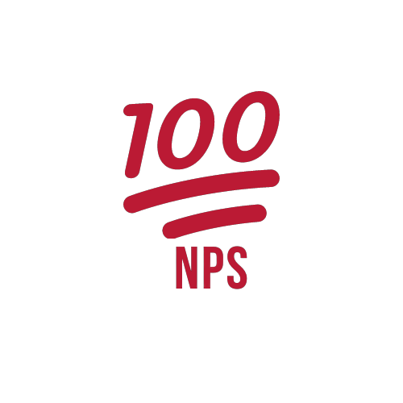
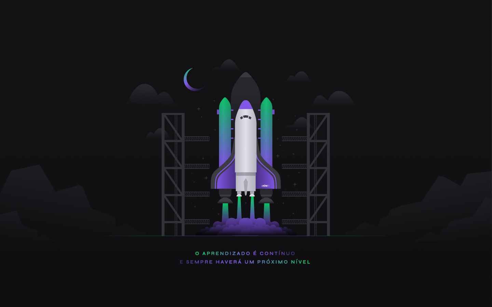

<p align="center">
  
</p>

<p align="center">
  
  
  
  
</p>

<p align="center">
  <a href="#sobre">Sobre</a> •
  <a href="#nps-api">NPS API</a> •
  <a href="#instalação">Instalação</a> •
  <a href="#tecnologias">Tecnologias</a> •
  <a href="#autor">Autor</a>  
</p>

## Sobre

Projeto desenvolvido durante a <strong>NLW IV</strong>, evento criado pela <strong><a href="https://rocketseat.com.br/">Rocketseat</a></strong>. Um evento 100% online e GRATUITO, com conteúdo exclusivo e INÉDITO.

Ocorreu do dia 21 ao dia 28 de Fevereiro de 2021 e teve como intuito mostrar na prática o poder da stack <strong><a href="https://nodejs.org/pt-br/">NodeJS</a></strong> + <strong><a href="https://pt-br.reactjs.org/">ReactJS</a></strong> + <strong><a href="https://reactnative.dev">React Native</a></strong> e como essas tecnologias podem te levar até os seus maiores objetivos como programador.

Essa edição da NLW contou com as trilhas separadas por tecnologias e esse projeto foi construído durante as aulas de NodeJS.



## NPS API

API de NPS escrita com NodeJS e Typescript durante a NLW IV, evento criado pela Rocketseat.

O NPS API é uma aplicação para calcular o NPS da empresa. A aplicação conta com funcionalidades como:

- [x] Cadastro de usuários.
- [x] Cadastro de pesquisas.
- [x] Envio de e-mail para os usuários responderem as pesquisas de satisfação e com isso podemos realizar o cálculo do NPS.

Deixo abaixo a estrutura do banco de dados que essa aplicação utiliza:


## Instalação

Antes de começar, você vai precisar ter instalado em sua máquina as seguintes ferramentas:
[Git](https://git-scm.com) e [Node.js](https://nodejs.org/en/). Além disso é bom ter um editor para trabalhar com o código como [VSCode](https://code.visualstudio.com/).

### 🎲 Rodando o Back End (servidor)

```bash
# Clone este repositório
$ git clone git@github.com:MrRioja/api-nlw4.git

# Acesse a pasta do projeto no terminal/cmd
$ cd api-nlw4

# Instale as dependências
$ npm install
# Caso prefira usar o Yarn execute o comando abaixo
$ yarn

# Execute as migrations
$ npm run typeorm migration:run
# Caso prefira usar o Yarn execute o comando abaixo
$ yarn typeorm migration:run

# Execute a aplicação em modo de desenvolvimento
$ npm run dev
# Caso prefira usar o Yarn execute o comando abaixo
$ yarn dev

# Execute os testes da aplicação
$ npm run test
# Caso prefira usar o Yarn execute o comando abaixo
$ yarn test

# O servidor iniciará na porta 3333 - acesse <http://localhost:3333>
```

## Tecnologias

[](https://skillicons.dev)

## Autor

<div align="center">

<h1>Luiz Rioja</h1>
<strong>Backend Developer</strong>
<br/>
<br/>

<a href="https://linkedin.com/in/luizrioja" target="_blank">

</a>

<a href="https://github.com/mrrioja" target="_blank">

</a>

<a href="mailto:lulyrioja@gmail.com?subject=Fala%20Dev" target="_blank">

</a>

<a href="https://api.whatsapp.com/send?phone=5511933572652" target="_blank">

</a>

<a href="https://join.skype.com/invite/tvBbOq03j5Uu" target="_blank">

</a>

<br/>
<br/>
</div>
